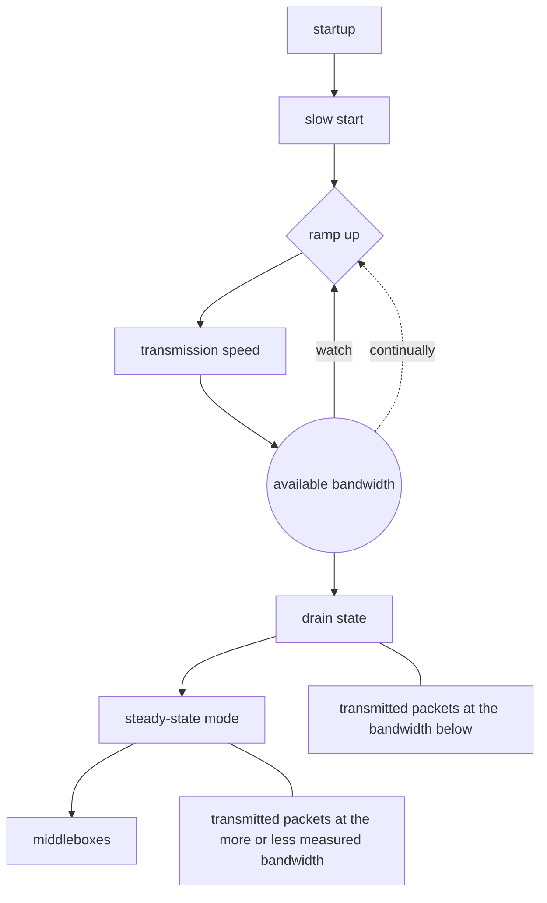

#### 流量控制

#### 拥塞处理(Congestion Handling)
网络上，通道的容量 = 带宽 * 往返延迟

1. 包重传
2. 超时重传

##### 慢热启动算法
在TCP连接开始的阶段，CWnd设置一个报文段，一次只能发送一个，当收到对这一个的确认时，CWnd加1，于是接下来，一次能够发送两个；当这两个确认到来的时候，CWnd加二，于是一次可以发送四个；当四个确认到来的时候，CWnd加四，于是一次发送八个。这个过程可以总结如下：
  * 连接建立好之后，初始设置CWnd = 1，表示可以传一个MSS大小的数据。
  * 每次收到一个ACK，cwnd就加1
  * 每次经过一个RTT，cwnd = cwnd * 2，可以看出，这是指数级上升。

很显然，不可能永远保持这样的上升速度，因此有一个ssthresh(slow start threshold)的上限值，大小为65535(2^16 - 1)，当超过这个值的时候，就要放慢发包的速度。具体的放慢过程是，每当收到一个确认后，cwnd增加1/cwnd，接着上面的过程

##### 拥塞避免算法
##### 拥塞状态时的算法
##### 快速恢复算法

####

### Congested Control Algorithm(CCA)

loss-based algorithm, rely on packet loss to detect congestion and lower rates of transmission

model-based algorithm,  The algorithm uses the maximum bandwidth and round-trip time at which the network delivered the most recent flight of outbound data packets to build a model of the network. Each cumulative or selective acknowledgment of packet delivery produces a rate sample which records the amount of data delivered over the time interval between the transmission of a data packet and the acknowledgment of that packet.

Since the available bandwidth will generally vary over time, that bandwidth estimate must be revised occasionally.

BBR
its primary metric --- the actual bandwidth of data delivered, 

    The TCP BBR algorithm continuously monitors the bandwidth measurement process, unlike traditional congestion algorithms which continue to ramp up until packets are dropped. The algorithm examines the delivered bandwidth over the last three round-trip times to see if it changes and continues to do so until the bandwidth stops rising, it concludes that it has found the effective bandwidth of the connection and can stop ramping up. 

conclusion: experienced the procession described above, an available bandwidth of the connection have been measured. but, in measuring that rate, the BBR algorithm probably transmitted packets at a higher rate for a while. some of them will be sitting in the queue waiting to be delivered. these packets need to be drained out of the buffer for keeping balance.

    the congested window in BBR algorithm is still set as a way of ensuring that there is never too much data in flight, but it is no longer the main machnism. instead, the tc-fq(Fair Queue traffic policing) packet scheduler to send out data at the proper rate. 

In general, TCP BBR is a complicated algorithm. While it may seem like it simply measures the bandwidth of a connection, the process of measurement is not simple. Even after the bandwidth has been measured, maintaining balance requires a lot of work, such as using middlebox mechanisms and setting the arguments for tc-fq, etc
